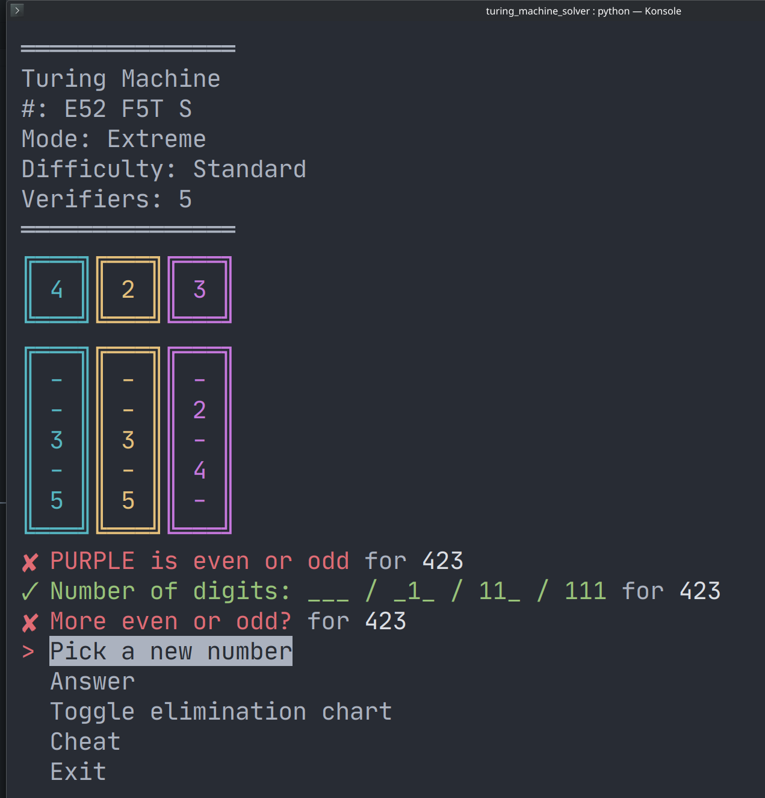

# Turing Machine board game solver

Game: https://www.turingmachine.info/



## Use

```bash
# Pre-download problems:
> python lib/download.py <FROM:int> <TO:int>

# Run game:
> python main.py <ID:int>
```
